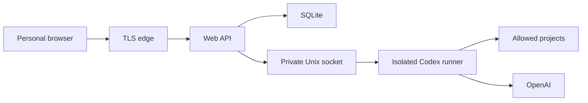

# Codex Web UI threat model

## Executive summary

This service is an Internet-reachable development control plane with remote-code-execution authority under its Linux service user. The dominant risks are account/session compromise, browser injection through untrusted agent output, path escape across projects, credential exfiltration from `CODEX_HOME`, and resource exhaustion on a shared host. Password-only single-user access is accepted by the owner, so strong password hashing, throttling, lockout, secure sessions, TLS and audit are mandatory; optional second-factor support remains recommended.

## Scope and assumptions

- In scope: the standalone reverse-proxied web/API service, SQLite metadata, bounded attachment storage, private app-server socket, registered project roots, server Codex home, package/bootstrap installer and runtime units.
- Out of scope: product CRM/Admin code, product databases and secrets, Provider/Telegram controls, Docker socket, root shell, and automatic deployment.
- One trusted human operator uses multiple personal devices.
- The service initially shares the existing Ubuntu host with other workloads.
- Public access is protected by HTTPS and application login. Password compromise remains a material residual risk.

## System model

### Primary components

- TLS reverse proxy and rate limits.
- React browser client.
- Node.js API, session and authorization boundary.
- SQLite metadata/session/audit/event store.
- Mode-0600 systemd Unix socket and bounded JSON-RPC adapter.
- A separate non-root Codex runner, `CODEX_HOME`, and allowlisted projects.

### Data flows and trust boundaries

- Browser -> edge: credentials, session cookie and UI requests over HTTPS; protected by TLS, limits and security headers.
- Edge -> API: authenticated REST/SSE; exact Origin, CSRF on mutations, schema and size validation.
- API -> SQLite: hashed sessions, projects, mappings, normalized events and audit records; no OpenAI token or chain-of-thought.
- API -> app-server: typed JSON-RPC over a private Unix socket; allowlisted methods, bounded messages and reconnect backoff. API and runner have separate OS identities.
- Local root terminal -> bootstrap: administrator credentials become a bounded Argon2id hash and random session secret through an atomic root-owned `0600` replacement; plaintext is neither logged nor placed in argv.
- Git checkout -> root bootstrap: reviewed installer code downloads exact Node.js/npm artifacts over HTTPS, verifies repository-pinned digests and installs immutable root-owned runtime directories.
- Codex runner terminal -> OpenAI device login: Codex displays and consumes the device flow directly as the non-root runner; the installer never captures the code or accepts an account token.
- Browser -> attachment store: authenticated multipart uploads with per-file, per-turn and per-thread bounds; only opaque IDs and safe metadata return to the browser.
- Attachment store -> app-server: signature-checked images use native `localImage`; inert common files are referenced only through a backend-generated path after thread ownership and realpath checks.
- App-server -> project: commands and file changes under the selected permission preset and Linux-user permissions.
- App-server -> OpenAI: server-side Codex credential; never crosses the browser boundary.

## Assets and security objectives

| Asset                           | Why it matters                                | Objective |
| ------------------------------- | --------------------------------------------- | --------- |
| Website password and sessions   | They authorize remote code execution          | C/I       |
| Codex account credential        | Account access, usage and spend               | C/I       |
| Source and Git state            | Product integrity and intellectual property   | C/I/A     |
| `AGENTS.md`, skills and config  | They control agent behavior and safety        | I         |
| Project secrets                 | May authorize external systems                | C/I       |
| Chats, diffs and command output | Can contain sensitive development data        | C/I/A     |
| Host resources                  | Shared-host availability                      | A         |
| Uploaded images and files       | May contain private data or hostile content   | C/I/A     |
| Managed runtime artifacts       | They execute with installer/service authority | I/A       |

## Attacker model

### Capabilities

- An unauthenticated Internet client can reach the login surface.
- Repository content and tool output can be attacker-controlled.
- A logged-in attacker can submit prompts and choose exposed permission presets.
- A malicious dependency can execute when an authorized Codex run invokes project tooling.

### Non-capabilities

- The attacker does not initially control the host, TLS private key, server environment or operator device.
- The service user has no sudo, root, Docker socket or product-runtime secret access by design.

## Entry points and attack surfaces

| Surface               | How reached           | Boundary                   | Planned controls                                                         |
| --------------------- | --------------------- | -------------------------- | ------------------------------------------------------------------------ |
| Login                 | Public HTTPS          | Internet to session        | Argon2id, throttling, lockout, generic errors                            |
| REST mutations        | Authenticated browser | Session to API             | CSRF, exact Origin, Zod, turn/action idempotency; bounded upload cleanup |
| SSE                   | Authenticated browser | API to browser             | Per-thread authorization, replay cursor, no secrets                      |
| Markdown/diffs/output | Codex events          | Untrusted output to DOM    | text-safe rendering, no raw HTML, CSP                                    |
| Project registration  | Admin form            | API to filesystem          | configured roots, realpath, symlink/path rejection                       |
| JSON-RPC              | Local child stdio     | API to Codex               | method/schema allowlist, IDs, size bounds                                |
| Attachment upload     | Authenticated browser | Browser to bounded storage | multipart/type/signature/size limits, opaque IDs                         |
| Attachment content    | Authenticated browser | Storage to browser         | thread ownership, `nosniff`, download non-images                         |
| Skills and rules      | Project/server files  | Filesystem to agent policy | pinned bundle, checksums, visible loaded sources                         |

## Top abuse paths

1. Attacker guesses or steals the password, obtains a session, starts a full-access run and exfiltrates reachable source or credentials.
2. Repository text injects HTML/script into streamed output; unsafe rendering steals the authenticated session or submits a turn.
3. A crafted project path or symlink escapes the allowlisted root and grants access to host files.
4. A prompt or dependency prints tokens into command output; unredacted persistence later exposes them through chat history or backup.
5. A forged cross-site request starts a destructive turn using the operator's cookie.
6. Parallel builds and runaway child processes exhaust CPU, RAM or disk and disrupt co-hosted applications.
7. A tampered skill weakens approvals or repository rules and is silently loaded by later threads.
8. A backend restart loses an approval state and incorrectly treats the request as accepted.
9. A forged or cross-thread attachment ID exposes another chat's file, or a crafted filename escapes the attachment directory.
10. A polyglot or mislabeled upload executes in the browser, or oversized uploads exhaust disk, memory, inodes or request workers.
11. App-server echoes an absolute `localImage` path in a `userMessage` item which is accidentally persisted or streamed to the browser.
12. A compromised Web API reads the Codex credential or directly tampers with projects because API and Codex share an OS identity.
13. Bootstrap secrets leak through argv/terminal echo, weak hashing, unsafe replacement or an accidental rerun.
14. A substituted Node.js, pnpm or Codex archive gains root-time or runner-time code execution during bootstrap.
15. A device code is captured, logged, shared or bound to root instead of the isolated runner account.

## Threat model table

| ID     | Threat                                                 | Existing controls                                            | Required mitigation                                                                                                                                                              | Likelihood | Impact   | Priority |
| ------ | ------------------------------------------------------ | ------------------------------------------------------------ | -------------------------------------------------------------------------------------------------------------------------------------------------------------------------------- | ---------- | -------- | -------- |
| TM-001 | Password/session compromise grants code execution      | Single owner, TLS planned                                    | Argon2id, strong secret, rate limit, lockout, rotation, audit; add TOTP/passkey later                                                                                            | medium     | high     | high     |
| TM-002 | Stored/reflected XSS through model/tool output         | React escaping planned                                       | No raw HTML, strict CSP, safe Markdown, hostile-output tests                                                                                                                     | medium     | high     | high     |
| TM-003 | Project path traversal or symlink escape               | Root allowlist planned                                       | `realpath` containment on registration and every execution, no client cwd                                                                                                        | medium     | high     | high     |
| TM-004 | Codex/OpenAI or project secret leakage                 | Server-only Codex home                                       | Redaction, output bounds, no raw env/logging, isolated service user                                                                                                              | medium     | high     | high     |
| TM-005 | CSRF or SSE authorization bypass                       | Same-site cookie planned                                     | Session-bound CSRF, Origin checks, per-thread authorization                                                                                                                      | medium     | high     | high     |
| TM-006 | Resource exhaustion harms shared host                  | Service cgroup plus startup/update/periodic soft disk guards | Enforce host filesystem byte/inode quota or dedicated bounded volumes; retain concurrency queue, timeouts and process-group cancellation                                         | high       | high     | critical |
| TM-007 | Skill/rule supply-chain tampering                      | Git-owned `AGENTS.md`                                        | Checksummed skill manifest, owner-only install, diagnostics and update audit                                                                                                     | medium     | high     | high     |
| TM-008 | Approval confusion after reconnect/restart             | App-server request IDs                                       | Durable pending state, fail closed, reconcile active requests, never auto-approve                                                                                                | medium     | high     | high     |
| TM-009 | Backend compromise reaches root/Docker/product secrets | None in new service yet                                      | Non-root user, inaccessible paths, no Docker socket, separate deploy broker                                                                                                      | low        | high     | high     |
| TM-010 | Cross-thread attachment access or path traversal       | Authenticated thread routes                                  | Opaque IDs, thread ownership on every read/claim/delete, generated storage names, realpath containment, hostile-ID tests                                                         | medium     | high     | high     |
| TM-011 | Hostile upload becomes browser or host execution       | React escaping, dedicated storage                            | Signature-check images, allowlisted types/extensions, `nosniff`, download non-images, never parse/execute/unzip in API                                                           | medium     | high     | high     |
| TM-012 | Uploads exhaust shared-host resources                  | Bounded ext4 application volume and tmpfs                    | 20 MiB/file, 8/turn, 50 MiB/thread, edge/body timeout, bounded in-memory parsing with failed-write cleanup, existing byte/inode/resource limits                                  | medium     | high     | high     |
| TM-013 | Internal attachment path leaks through Codex events    | Safe normalized event projection                             | Ignore live app-server `userMessage` items and fragmented agent deltas; publish redacted completed messages; persist one backend-authored user event; path-leak regression tests | medium     | high     | high     |
| TM-014 | Bootstrap leaks or silently replaces admin secrets     | Local root-only bootstrap                                    | Hidden TTY entry, bounded Argon2id, CSPRNG session secret, atomic `0600` replacement, explicit `--rotate`, no secrets in argv/logs                                               | low        | high     | high     |
| TM-015 | Web API compromise reaches Codex credentials/projects  | Dedicated API and runner identities                          | Private systemd socket, separate environments, API cannot read `CODEX_HOME`, runner cannot read Web secrets/SQLite, explicit project and attachment mounts                       | low        | high     | high     |
| TM-016 | Toolchain supply-chain substitution during bootstrap   | HTTPS downloads                                              | Exact versions, committed SHA-256/SHA-512 digests, immutable root-owned version directories, no shell-pipe installer or floating tags, package inventory verification            | low        | critical | high     |
| TM-017 | Device authentication leaks or uses the wrong identity | Local interactive operator                                   | Run `codex login --device-auth` only via `runuser` as the runner with direct `/dev/tty`, never capture output/token, warn against code sharing, recheck authenticated state      | low        | high     | high     |

## Criticality calibration

- Critical: reliable host takeover, production-secret compromise, or resource exhaustion that repeatedly takes down co-hosted production.
- High: website auth bypass, source/Codex credential exfiltration, cross-project write, or approval bypass.
- Medium: bounded transcript disclosure, recoverable single-thread corruption, or targeted temporary denial of service.
- Low: non-sensitive metadata leakage or noisy failures with no authority gain.

## Focus paths for security review

| Path                                  | Reason                                      | Threats                        |
| ------------------------------------- | ------------------------------------------- | ------------------------------ |
| `apps/server/src/auth/`               | Public authentication and session authority | TM-001, TM-005                 |
| `apps/server/src/codex/`              | RCE-capable protocol and approval boundary  | TM-004, TM-008, TM-009         |
| `apps/server/src/projects/`           | Filesystem containment                      | TM-003                         |
| `apps/server/src/events/`             | Redaction, retention and reconnect          | TM-002, TM-004                 |
| `apps/server/src/attachment-store.ts` | Upload validation, containment and cleanup  | TM-010, TM-011, TM-012, TM-013 |
| `apps/web/src/`                       | Rendering of untrusted content              | TM-002, TM-005                 |
| `infra/`                              | TLS, non-root service and resource limits   | TM-001, TM-006, TM-009         |
| `scripts/bootstrap-ubuntu.sh`         | Root-time package and toolchain bootstrap   | TM-016, TM-017                 |
| `skills/manifest.json`                | Agent-policy supply chain                   | TM-007                         |

## Quality check

- Public login, authenticated API/SSE, local JSON-RPC, filesystem, OpenAI and skill boundaries are covered.
- Product runtime and its secrets are explicitly outside the dev control plane.
- The owner confirmed one operator, same-host placement and desktop-equivalent Codex permissions.
- Password-only exposure remains an accepted residual risk; second factor is recommended.
- Supported portable targets are Ubuntu 22.04/24.04 on x64/arm64. Public plaintext HTTP and automatically
  generated bare-IP certificates are excluded; operators supply a domain-backed HTTPS proxy or valid keypair.
- The reference deployment uses a dedicated 80 GiB ext4 volume with a fixed inode ceiling for state,
  projects and releases, plus bounded `/tmp` and `/var/tmp` tmpfs mounts. Portable installation defaults
  target a dedicated personal server and retain soft fail-closed guards. On a shared host, use `--no-start`
  until equivalent administrator-enforced byte and inode bounds exist; the disk monitor is secondary rather
  than a hard quota.
- Attachment upload itself has no idempotency key. A lost upload response can create an unused duplicate;
  this tab cleans up only staged IDs it can prove it owns when navigating, while the 50 MiB thread ceiling
  bounds reload and network-unknown leftovers. An ambiguous `turn/start` claim remains unavailable rather
  than risking duplicate execution.
