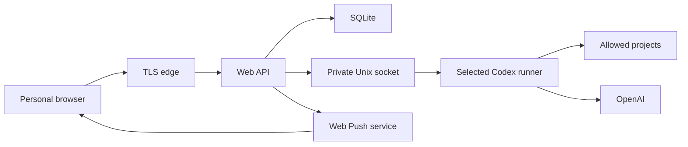

# Codex Web UI threat model

## Executive summary

This service is an Internet-reachable development control plane. Restricted mode has code-execution authority
under one non-root Linux user; explicit host-admin mode has host-root authority. The dominant risks are therefore
account/session compromise, prompt or project injection, browser injection through untrusted output, credential
exfiltration, unsafe runner migration and resource exhaustion. Password-only single-user access and optional
root runner authority are accepted by the owner, so strong password hashing, throttling, lockout, secure
sessions, TLS, audit and an explicit fail-closed mode choice are mandatory; second factor remains recommended.

## Scope and assumptions

- In scope: the standalone reverse-proxied web/API service, SQLite metadata, bounded attachment storage,
  ephemeral voice transcription, per-device Web Push subscriptions and delivery queue, private app-server
  socket, registered project roots, server Codex home, package/bootstrap installer and runtime units.
- Out of scope: product CRM/Admin code, product databases and Provider/Telegram controls, browser-controlled
  Docker access, browser-controlled runner-mode changes and automatic deployment. Host-root Codex execution is
  in scope only when the operator explicitly installs or migrates to `host-admin`.
- One trusted human operator uses multiple personal devices.
- The service initially shares the existing Ubuntu host with other workloads.
- Public access is protected by HTTPS and application login. Password compromise remains a material residual risk.
- The owner explicitly wants a dedicated-host option in which authenticated Codex tasks may administer the
  complete machine and accepts that a compromised session or injected task can then become root execution.
- Restricted remains the fresh-install default. A normal upgrade cannot change runner identity; migration must
  drain work and preserve both the Web database and complete Codex home with rollback evidence.
- Resource-control settings are single-owner administrative mutations. The owner confirmed automatic mode must
  reserve at least 15% of host RAM (and never less than 1 GiB) plus one CPU core; disk remains on the fixed
  80 GiB bounded volume. "Unlimited" means no lower manual ceiling, never permission to exceed the detected
  host or ancestor-cgroup capacity.

## System model

### Primary components

- TLS reverse proxy and rate limits.
- React browser client.
- Node.js API, session and authorization boundary.
- SQLite metadata/session/audit/event store.
- Mode-0600 systemd Unix socket and bounded JSON-RPC adapter.
- A selected Codex runner (`restricted` non-root or explicit `host-admin` root), its `CODEX_HOME`, and configured
  project roots.

### Data flows and trust boundaries

- Browser -> edge: credentials, session cookie and UI requests over HTTPS; protected by TLS, limits and security headers.
- Edge -> API: authenticated REST/SSE; exact Origin, CSRF on mutations, schema and size validation.
- API -> SQLite: hashed sessions, projects, mappings, normalized events and audit records; no OpenAI token or chain-of-thought.
- API -> app-server: typed JSON-RPC over a private Unix socket; allowlisted methods, bounded messages and
  reconnect backoff. The API remains non-root in both modes. The restricted runner is a separate non-root
  identity; the host-admin runner is root and is deliberately not contained from host files/services.
- API -> resource broker: a fixed, typed local Unix-socket protocol requests only CPU, memory and task-count
  policy for one fixed workload slice. The root broker verifies peer credentials, re-detects host capacity,
  rejects unsafe values and never accepts commands, paths, unit names or property names from the browser/API.
- API -> project-path broker (host-admin only): a distinct root, read-only, socket-activated service verifies
  the API peer, reads its own root-owned allowlist, opens one absolute candidate path, resolves symlinks and
  checks type/inode/containment. It returns only a canonical path or coarse error and cannot read file content,
  enumerate directories, mutate the host or accept roots/policy from the API.
- API -> Codex update broker: a separate fixed Unix-socket protocol exposes only status and activation of one
  operator-staged immutable release or one repository-reviewed runtime target. The root broker authenticates
  the API peer and accepts no URL, path, version, command, unit or package name from the browser/API; Codex and
  the API remain non-root.
- API -> npm registry metadata: the non-root API sends a GET only to the compile-time fixed official
  `@openai/codex/latest` endpoint. Redirects are rejected and timeout, response bytes and semantic-version
  syntax are bounded. The result is informational and cannot become an update candidate.
- Local root terminal -> bootstrap: administrator credentials become a bounded Argon2id hash and random session secret through an atomic root-owned `0600` replacement; plaintext is neither logged nor placed in argv.
- Git checkout -> root bootstrap: reviewed installer code downloads exact Node.js/npm artifacts over HTTPS, verifies repository-pinned digests and installs immutable root-owned runtime directories.
- Verified package -> web-only updater -> Nginx: the installed verifier checks the complete package inventory,
  the manifest must match the active backend `apiCompatibility`, and a root-owned atomic symlink selects only
  immutable static assets without restarting the API or Codex runner.
- Codex runner terminal -> OpenAI device login: during bootstrap Codex displays and consumes the device flow
  directly as the selected runner; root is allowed only after explicit host-admin selection. The installer
  never captures the code or accepts an account token.
- Restricted state -> host-admin migration: after admission drain and runner shutdown, a root-only local
  workflow preserves SQLite unchanged, copies the complete Codex home without merging profiles, validates the
  copy, activates the root runner and retains rollback state through health verification.
- Authenticated owner browser -> Web API -> app-server device login: after bootstrap the API may relay one
  short-lived verification URL/code from the isolated runner to the current owner session. It never receives
  credential tokens or reads `CODEX_HOME`, and task admission is closed for the lifetime of the flow.
- Browser -> attachment store: authenticated multipart uploads with per-file, per-turn and per-thread bounds; only opaque IDs and safe metadata return to the browser. Both new turns and active-turn steer may claim staged IDs.
- Browser -> API -> local transcription model: an explicit microphone action converts one clip to canonical
  PCM WAV and sends it through an authenticated, CSRF-protected request. The API enforces type, byte-size,
  decoded duration, silence, concurrency and rate bounds, runs one warmed CPU-only model inside the workload
  resource ceiling and returns text without persisting audio. Production inference has remote model access
  disabled.
- Browser -> API -> push service: an explicit per-chat action supplies a standard PushSubscription after
  browser permission. Exact Origin, session auth, CSRF and bounded schemas protect mapping changes. The API
  sends only an opaque chat identifier and generic terminal state using host-local VAPID credentials; chat
  names, endpoints and key material
  stay in the protected database/environment and are never returned as a list or written to audit metadata.
- Attachment store -> app-server: signature-checked images use native `localImage`; inert common files are referenced only through a backend-generated path after thread ownership and realpath checks.
- App-server -> project: commands and file changes under the selected permission preset and Linux-user permissions.
- App-server -> OpenAI: server-side Codex credential; never crosses the browser boundary.

## Assets and security objectives

| Asset                           | Why it matters                                                             | Objective |
| ------------------------------- | -------------------------------------------------------------------------- | --------- |
| Website password and sessions   | They authorize remote code execution                                       | C/I       |
| Codex account credential        | Account access, usage and spend                                            | C/I       |
| Source and Git state            | Product integrity and intellectual property                                | C/I/A     |
| `AGENTS.md`, skills and config  | They control agent behavior and safety                                     | I         |
| Project secrets                 | May authorize external systems                                             | C/I       |
| Chats, diffs and command output | Can contain sensitive development data                                     | C/I/A     |
| Host resources                  | Shared-host availability                                                   | A         |
| Uploaded images and files       | May contain private data or hostile content                                | C/I/A     |
| Temporary voice recordings      | May contain private speech and incur API cost                              | C/A       |
| Push endpoints and key material | Address personal devices and authorize pushes                              | C/I       |
| Managed runtime artifacts       | They execute with installer/service authority                              | I/A       |
| Host root authority             | Controls every local service, credential and file in host-admin mode       | C/I/A     |
| Migration rollback state        | Preserves chats, rollout history and authentication during identity change | C/I/A     |

## Attacker model

### Capabilities

- An unauthenticated Internet client can reach the login surface.
- Repository content and tool output can be attacker-controlled.
- A logged-in attacker can submit prompts and choose exposed permission presets. If the operator installed
  host-admin, full-access work executes as root.
- A malicious dependency can execute when an authorized Codex run invokes project tooling.

### Non-capabilities

- The attacker does not initially control the host, TLS private key, server environment or operator device.
- In restricted mode the runner has no sudo, root, Docker socket or product-runtime secret access by design.
- In host-admin mode no filesystem/service boundary protects the host from the Codex runner; only Web
  authentication, task admission and the operator's prompt/project trust remain before root execution.

## Entry points and attack surfaces

| Surface               | How reached           | Boundary                     | Planned controls                                                                        |
| --------------------- | --------------------- | ---------------------------- | --------------------------------------------------------------------------------------- |
| Login                 | Public HTTPS          | Internet to session          | Argon2id, throttling, lockout, generic errors                                           |
| REST mutations        | Authenticated browser | Session to API               | CSRF, exact Origin, Zod, turn/action idempotency; bounded upload cleanup                |
| SSE                   | Authenticated browser | API to browser               | Per-thread authorization, replay cursor, no secrets                                     |
| Markdown/diffs/output | Codex events          | Untrusted output to DOM      | text-safe rendering, no raw HTML, CSP                                                   |
| Project registration  | Admin form            | API to filesystem            | configured roots, realpath, symlink/path rejection                                      |
| JSON-RPC              | Local child stdio     | API to Codex                 | method/schema allowlist, IDs, size bounds                                               |
| Attachment upload     | Authenticated browser | Browser to bounded storage   | multipart/type/signature/size limits, opaque IDs                                        |
| Attachment content    | Authenticated browser | Storage to browser           | thread ownership, `nosniff`, download non-images                                        |
| Voice transcription   | Authenticated browser | Browser/API to local model   | CSRF/origin, canonical WAV/size/time/rate bounds, idempotency, no persistence           |
| Push subscription     | Authenticated browser | Browser/API to push service  | Explicit permission; CSRF/origin; bounded HTTPS endpoint/keys; generic payload          |
| Skills and rules      | Project/server files  | Filesystem to agent policy   | pinned bundle, checksums, visible loaded sources                                        |
| Codex update          | Authenticated browser | API to narrow root broker    | fixed reviewed candidate, peer credentials, no caller path/command, checksums, rollback |
| Runner-mode install   | Local root terminal   | Operator to systemd/Codex    | restricted default, explicit host-admin value, protected persisted mode                 |
| Runner migration      | Local root terminal   | Non-root state to root state | idle drain, collision rejection, complete state copy, health-gated rollback             |

## Top abuse paths

1. Attacker guesses or steals the password, obtains a session, starts a full-access run and exfiltrates reachable source or credentials.
2. Repository text injects HTML/script into streamed output; unsafe rendering steals the authenticated session or submits a turn.
3. A crafted project path or symlink escapes the allowlisted root and grants access to host files.
4. A prompt or dependency prints tokens into command output; unredacted persistence later exposes them through chat history or backup.
5. A forged cross-site request starts a destructive turn using the operator's cookie.
6. Parallel builds and runaway child processes exhaust CPU, RAM or disk and disrupt co-hosted applications.
7. A tampered skill weakens approvals or repository rules and is silently loaded by later threads.
8. A backend restart loses an approval state and incorrectly treats the request as accepted.
9. A forged, reused or cross-thread attachment ID exposes another chat's file, escapes the attachment directory,
   or is attached twice when an active-turn steer has an ambiguous outcome.
10. A polyglot or mislabeled upload executes in the browser, or oversized uploads exhaust disk, memory, inodes or request workers.
11. App-server echoes an absolute `localImage` path in a `userMessage` item which is accidentally persisted or streamed to the browser.
12. A compromised Web API reads the Codex credential or directly tampers with projects because API and Codex share an OS identity.
13. Bootstrap secrets leak through argv/terminal echo, weak hashing, unsafe replacement or an accidental rerun.
14. A substituted Node.js, pnpm or Codex archive gains root-time or runner-time code execution during bootstrap.
15. A device code is persisted, logged, exposed to another session, redirected to an attacker-controlled
    origin, shared by the owner, or bound to root instead of the isolated runner account.
16. A stolen admin session weakens resource controls, or a compromised API abuses a broad privileged helper,
    causing host denial of service or root-level command execution.
17. A limit update races a new turn or lowers memory below live usage, killing active root/subagent work.
18. A tampered or API-incompatible web-only release is activated while Codex work continues, enabling browser
    compromise or sending requests the live backend cannot safely interpret.
19. A stolen session repeatedly uploads audio to exhaust memory or CPU, hold request workers or disrupt Codex;
    a substituted model artifact executes unreviewed code/data or a failure leaks a private transcript to logs.
20. A stolen session registers or removes another device endpoint, repeated terminal events amplify outbound
    delivery, or a detailed payload leaks project content through a push provider or lock screen.
21. A compromised API abuses a broad updater as a root confused deputy, races candidate replacement, feeds a
    traversal/archive bomb to extraction, or activates a CLI whose generated app-server protocol differs from
    the reviewed backend contract.
22. An operator or broken upgrade changes the runner to root implicitly, turning an expected non-root task into
    host takeover without a deliberate trust decision.
23. A partial or colliding migration starts root Codex with an empty or unrelated profile, loses rollout/chat
    continuity, or leaves duplicated credentials readable by the previous non-root identity.

## Threat model table

| ID     | Threat                                                                               | Existing controls                                                                            | Required mitigation                                                                                                                                                                                                                                                                                                                                             | Likelihood | Impact   | Priority |
| ------ | ------------------------------------------------------------------------------------ | -------------------------------------------------------------------------------------------- | --------------------------------------------------------------------------------------------------------------------------------------------------------------------------------------------------------------------------------------------------------------------------------------------------------------------------------------------------------------- | ---------- | -------- | -------- |
| TM-001 | Password/session compromise grants code execution                                    | Single owner, TLS planned                                                                    | Argon2id, strong secret, rate limit, lockout, rotation, audit; add TOTP/passkey later                                                                                                                                                                                                                                                                           | medium     | high     | high     |
| TM-002 | Stored/reflected XSS through model/tool output                                       | React escaping planned                                                                       | No raw HTML, strict CSP, safe Markdown, hostile-output tests                                                                                                                                                                                                                                                                                                    | medium     | high     | high     |
| TM-003 | Project path traversal, symlink escape or privileged resolver confused deputy        | Canonical root allowlist and exact stored cwd                                                | Direct non-root validation in restricted mode; in host-admin use a separate read-only broker with API `SO_PEERCRED`, root-owned allowlist, exact bounded schema, stable opened-inode/type/realpath containment, coarse errors and no content/list/write operation. Preserve `canonical === stored path`; no browser resolver route.                             | medium     | high     | high     |
| TM-004 | Codex/OpenAI or project secret leakage                                               | Server-only Codex home                                                                       | Redaction, output bounds, no raw env/logging, isolated service user                                                                                                                                                                                                                                                                                             | medium     | high     | high     |
| TM-005 | CSRF or SSE authorization bypass                                                     | Same-site cookie planned                                                                     | Session-bound CSRF, Origin checks, per-thread authorization                                                                                                                                                                                                                                                                                                     | medium     | high     | high     |
| TM-006 | Resource exhaustion harms shared host                                                | Bounded volume and static service cgroups                                                    | Aggregate API/runner in one workload slice; default auto reserve of 15% RAM/minimum 1 GiB plus one CPU; count root turns and subagents; live admission, process-tree cleanup, typed limits and kernel read-back. In host-admin this is an operational default, not containment from a malicious root task.                                                      | high       | high     | critical |
| TM-007 | Skill/rule supply-chain tampering                                                    | Git-owned `AGENTS.md`                                                                        | Checksummed skill manifest, owner-only install, diagnostics and update audit                                                                                                                                                                                                                                                                                    | medium     | high     | high     |
| TM-008 | Approval confusion after reconnect/restart                                           | App-server request IDs                                                                       | Durable pending state, fail closed, reconcile active requests, never auto-approve                                                                                                                                                                                                                                                                               | medium     | high     | high     |
| TM-009 | Backend compromise reaches root/Docker/product secrets                               | None in new service yet                                                                      | Non-root user, inaccessible paths, no Docker socket, separate deploy broker                                                                                                                                                                                                                                                                                     | low        | high     | high     |
| TM-010 | Cross-thread attachment access, reuse or path traversal                              | Authenticated thread routes                                                                  | Opaque IDs; thread ownership on every read/claim/delete; generated storage names and realpath containment; one shared start/steer claim lifecycle; release only on proven pre-dispatch failure; preserve ambiguous claims; hostile-ID, duplicate, replay and outcome-unknown tests                                                                              | medium     | high     | high     |
| TM-011 | Hostile upload becomes browser or host execution                                     | React escaping, dedicated storage                                                            | Signature-check images, allowlisted types/extensions, `nosniff`, download non-images, never parse/execute/unzip in API                                                                                                                                                                                                                                          | medium     | high     | high     |
| TM-012 | Uploads exhaust shared-host resources                                                | Bounded ext4 application volume and tmpfs                                                    | 20 MiB/file, 8/turn, 50 MiB/thread, edge/body timeout, bounded in-memory parsing with failed-write cleanup, existing byte/inode/resource limits                                                                                                                                                                                                                 | medium     | high     | high     |
| TM-013 | Internal attachment path leaks through Codex events                                  | Safe normalized event projection                                                             | For both start and steer, ignore live app-server `userMessage` items and fragmented agent deltas; publish one backend-authored completed message with safe metadata; redact complete agent output; path-leak regression tests                                                                                                                                   | medium     | high     | high     |
| TM-014 | Bootstrap leaks or silently replaces admin secrets                                   | Local root-only bootstrap                                                                    | Hidden TTY entry, bounded Argon2id, CSPRNG session secret, atomic `0600` replacement, explicit `--rotate`, no secrets in argv/logs                                                                                                                                                                                                                              | low        | high     | high     |
| TM-015 | Web API compromise reaches Codex credentials/projects                                | Dedicated API and runner identities                                                          | Private systemd socket, separate environments, API cannot read `CODEX_HOME`, runner cannot read Web secrets/SQLite, explicit project and attachment mounts                                                                                                                                                                                                      | low        | high     | high     |
| TM-016 | Toolchain supply-chain substitution during bootstrap                                 | HTTPS downloads                                                                              | Exact versions, committed SHA-256/SHA-512 digests, immutable root-owned version directories, no shell-pipe installer or floating tags, package inventory verification                                                                                                                                                                                           | low        | critical | high     |
| TM-017 | Device authentication leaks, races active work or uses the wrong identity            | Bootstrap uses direct runner TTY; runtime has Web auth/CSRF                                  | Bootstrap via runner `/dev/tty`; runtime uses only pinned app-server device login, exact-Origin/CSRF, strict `auth.openai.com` URL projection, one in-memory flow with timeout/cancel, no code/token persistence or audit, warning against sharing, and an idle-only admission interlock that releases only after a terminal result or confirmed cancellation   | low        | high     | high     |
| TM-018 | Resource settings become a root confused deputy                                      | Authenticated API may request resource changes                                               | Separate root-owned broker; mode-0600 socket and `SO_PEERCRED`; fixed target/properties; strict schema/capacity/floor checks; no shell; atomic policy and rollback; journald plus API audit                                                                                                                                                                     | low        | critical | high     |
| TM-019 | Reconfiguration interrupts active work or races admission                            | Active root turns/subagents and concurrent Apply/start                                       | Serialize admission with a pending/applying gate; apply only after root turns, pending starts and active subagents reach zero; recheck current usage and read back kernel state                                                                                                                                                                                 | medium     | high     | high     |
| TM-020 | Web-only release is tampered, escapes storage or mismatches the live API             | Root operator invokes the static updater with a new package                                  | Verify with the installed checksummed package verifier; reject symlink/special-file inventory and `apiCompatibility` mismatch; copy root-owned immutable release; atomic bounded `web-current`; independent rollback; never restart Codex                                                                                                                       | low        | high     | high     |
| TM-021 | Voice upload leaks speech, exhausts resources or loads a substituted model           | Authenticated session and shared workload resource ceiling                                   | Canonical PCM WAV and bounded in-memory multipart body; decoded duration/silence checks; one active transcription plus request window; session/audio-bound TTL idempotency; pinned revision and complete manifest/hash/symlink verification; runtime network disabled; generic errors; never persist/log audio; expose only availability/model/bounds           | medium     | high     | high     |
| TM-022 | Push subscription abuse leaks metadata or amplifies outbound delivery                | Authenticated session, browser permission and VAPID keypair                                  | Exact Origin/CSRF; per-thread and global subscription limits; approved push-provider origins; bounded queue/retries; unique terminal delivery; stale-endpoint deletion; never list endpoints; generic payload without chat names/transcript/tool/file content; audit only safe hashes/IDs                                                                       | medium     | medium   | medium   |
| TM-023 | Codex updater becomes a root confused deputy or activates incompatible code          | Staged full release or one root-owned reviewed runtime target                                | Dedicated mode-0600 socket and `SO_PEERCRED`; exact status/apply schema; no caller path/URL/version/command/unit; candidate lock and containment; committed dual-architecture digests; bounded link/special-file-free extraction; unprivileged candidate-generated protocol byte comparison; idle interlock; fixed oneshot; health-gated transactional rollback | low        | critical | high     |
| TM-024 | Host-admin turns session or prompt compromise into host-root execution               | Restricted is default; Web auth, CSRF/origin, audit and private app-server socket remain     | Require an explicit local install/migration flag; keep API non-root; never expose mode switching in Web UI; recommend a strong unique password and second factor; monitor host-admin/full-access starts                                                                                                                                                         | medium     | critical | critical |
| TM-025 | Runner migration loses dialogues or leaves a privileged credential residue           | Ordinary upgrade rejects identity changes; Web SQLite and Codex home have separate ownership | Drain and stop all work; refuse profile merge; copy and verify the full Codex home; preserve SQLite; revoke old-user access to the retained rollback source; restore the old unit/config/state on failure                                                                                                                                                       | low        | high     | high     |
| TM-026 | Registry metadata/download is redirected, oversized or forged to influence an update | Fixed origin plus repository-reviewed target and archive digests                             | Keep discovery non-root; reject redirects; bound metadata/archive/expanded size and entry count; require exact package/version/tarball URLs plus published and committed SHA-512; never accept browser target fields; require unprivileged protocol reproduction before activation                                                                              | low        | high     | high     |

## Criticality calibration

- Critical: reliable host takeover, production-secret compromise, or resource exhaustion that repeatedly takes down co-hosted production.
- High: website auth bypass, source/Codex credential exfiltration, cross-project write, or approval bypass.
- Medium: bounded transcript disclosure, recoverable single-thread corruption, or targeted temporary denial of service.
- Low: non-sensitive metadata leakage or noisy failures with no authority gain.

## Focus paths for security review

| Path                                     | Reason                                        | Threats                        |
| ---------------------------------------- | --------------------------------------------- | ------------------------------ |
| `apps/server/src/auth/`                  | Public authentication and session authority   | TM-001, TM-005                 |
| `apps/server/src/codex/`                 | RCE-capable protocol and approval boundary    | TM-004, TM-008, TM-009         |
| `apps/server/src/projects/`              | Filesystem containment                        | TM-003                         |
| `apps/server/src/events/`                | Redaction, retention and reconnect            | TM-002, TM-004                 |
| `apps/server/src/attachment-store.ts`    | Upload validation, containment and cleanup    | TM-010, TM-011, TM-012, TM-013 |
| `apps/server/src/audio-transcription.ts` | Local model integrity and ephemeral audio     | TM-021                         |
| `apps/server/src/push-notifications.ts`  | External delivery, retry and stale endpoints  | TM-022                         |
| `apps/web/public/push-service-worker.js` | Background display and click navigation       | TM-002, TM-022                 |
| `apps/web/src/`                          | Rendering of untrusted content                | TM-002, TM-005                 |
| `infra/`                                 | TLS, runner modes and resource limits         | TM-001, TM-006, TM-009, TM-024 |
| `scripts/install-package.sh`             | Explicit mode selection and upgrade guards    | TM-016, TM-017, TM-024, TM-025 |
| `scripts/` migration/instruction helpers | State preservation and root policy injection  | TM-007, TM-024, TM-025         |
| `scripts/resource-broker.py`             | Narrow root resource-policy boundary          | TM-006, TM-018, TM-019         |
| `scripts/bootstrap-ubuntu.sh`            | Root-time package and toolchain bootstrap     | TM-016, TM-017                 |
| `scripts/update-web-ubuntu.sh`           | Live static activation and compatibility gate | TM-020                         |
| `scripts/codex-update-broker.py`         | Narrow root full-release activation boundary  | TM-016, TM-019, TM-023         |
| `scripts/codex-update-worker.sh`         | Fixed health-checked update/rollback worker   | TM-019, TM-023                 |
| `skills/manifest.json`                   | Agent-policy supply chain                     | TM-007                         |

## Quality check

- Public login, authenticated API/SSE, local JSON-RPC, filesystem, OpenAI and skill boundaries are covered.
- Product runtime and its secrets are explicitly outside the dev control plane.
- The owner confirmed one operator, same-host placement and desktop-equivalent Codex permissions.
- The owner explicitly confirmed that host-admin should be available and that this installation should migrate
  to it without losing Web chats or Codex rollout history. Root mode is treated as a dedicated-host trust
  choice, not as protection against a malicious authenticated task.
- Password-only exposure remains an accepted residual risk; second factor is recommended.
- Supported portable targets are Ubuntu 22.04/24.04 on x64/arm64. Public plaintext HTTP and automatically
  generated bare-IP certificates are excluded; operators supply a domain-backed HTTPS proxy or valid keypair.
- The reference deployment uses a dedicated 80 GiB ext4 volume with a fixed inode ceiling for state,
  projects and releases, plus bounded `/tmp` and `/var/tmp` tmpfs mounts. Portable installation defaults
  target a dedicated personal server and retain soft fail-closed guards. On a shared host, use `--no-start`
  until equivalent administrator-enforced byte and inode bounds exist; the disk monitor is secondary rather
  than a hard quota.
- Attachment upload itself has no idempotency key. A lost upload response can create an unused duplicate;
  this tab cleans up only staged IDs it can prove it owns when navigating, while the 50 MiB thread ceiling
  bounds reload and network-unknown leftovers. An ambiguous `turn/start` claim remains unavailable rather
  than risking duplicate execution.
- Web Push providers necessarily observe a device endpoint and delivery timing. The application minimizes
  payload content but cannot hide that metadata from the device vendor's push service. Browser permission is
  per device, and a valid trusted HTTPS context is required.
